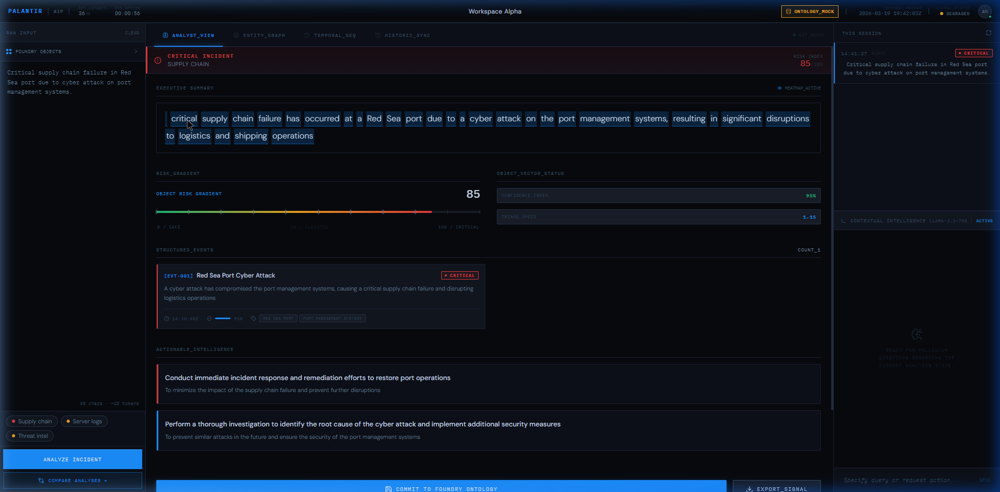
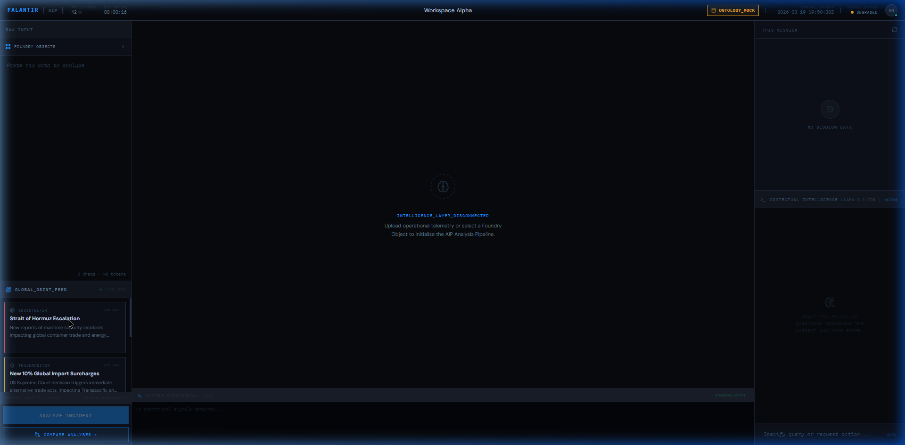

# 🛰️ AIP Operations Console


### Sub-millisecond Intelligence | Operational Triage | Palantir Foundry Integrated 

The **AIP Operations Console** is a high-fidelity, Palantir-style AI-assisted workspace designed for rapid incident triage and operational intelligence. By bridging the gap between raw, unstructured telemetry and the **Foundry Ontology**, it enables analysts to transform chaotic signals into structured, actionable decisions.

---

## 🏗️ Core Architecture

The platform operates on a **dual-brain-architecture** designed for reliability and intelligence:

1.  **Groq Intelligence Layer**: Utilizes `llama-3.3-70b-versatile` for ultra-fast, streaming analysis. It structures, classifies, and prioritizes raw operational data (logs, alerts, OSINT) with precise confidence scoring.
2.  **Foundry Ontology Layer**: Integrates directly with Palantir Foundry REST APIs. 
    *   **Ontology Reads**: Load and inspect real-world Object Vectors.
    *   **Action Writes**: Commit triaged results back to the Foundry Ontology via safe Action calls.
    *   **Mock-Ready**: Runs in "Ontology Mock" mode by default, allowing full feature exploration without a live session token.

---

## ⚡ "Elite" Tier Capabilities

This console is equipped with advanced intelligence patterns used in high-stakes operational environments:

### 1. **Cognitive Divergence Analysis (HIL)**
*   **Comparison Mode**: Deploy two distinct AI personas (Conservative vs. Pragmatic) to evaluate the same signal.
*   **Risk Delta (Δ)**: Real-time mathematical calculation of the gap between different interpretations.
*   **Divergence Heatmap**: High-fidelity highlights (amber pulse) on phrases where the AI models disagree, drawing the analyst's eye to interpretative risks.

### 2. **Operational Tension & Signal Feed**
*   **AIP Heartbeat**: A mini-sparkline in the Navbar tracks session-wide **Risk Trends** across multiple analyses.
*   **System Operational Log**: A scrolling terminal feed at the bottom that provides low-level transparency into the AIP processing pipeline and API lifecycle.

### 3. **Global OSINT Live Feed**

*   **Integrated Signals**: Real-time monitoring of maritime, cyber, and trade news.
*   **One-Click Import**: Instantly pull external world events into the AIP analysis pipeline for immediate impact assessment on your internal logistics.

### 4. **Foundry Action Forge**

*   **Human-in-the-loop Override**: Before committing a "Vector" back to Foundry, the analyst can manually override AI-suggested severity and summary.
*   **Atomic Commit Preview**: A live JSON preview updates as you make overrides, ensuring data integrity before persistence.

---

## 🛠️ Tech Stack & Design

*   **Runtime**: React 18 + Vite (Ultralight, no heavy state libraries)
*   **Styling**: Vanilla CSS-in-JS + Tailwind Utilities. Uses the **"Foundry Dark"** design system (`--bg: #07090e`).
*   **Visualization**: D3-powered Force-Directed Graphs + Recharts Risk Sparklines.
*   **Typography**: Inter (UI) & IBM Plex Mono (Operational Data).
*   **Icons**: Lucide-React for high-density iconography.

---

## 🚀 Setup & Deployment

### Prerequisites
- Node.js 18+
- Groq Cloud API Key ([Get it for free](https://console.groq.com))

### Quick Start
```bash
# Install dependencies
npm install

# Start the dev server
npm run dev
```

### Environment Variables (`.env.local`)
Configure your keys for live intelligence and Foundry integration:
```env
# AI Intelligence
VITE_GROQ_API_KEY=your_groq_key_here

# Palantir Foundry Integration (Optional)
VITE_FOUNDRY_HOST=your-instance.palantirfoundry.com
VITE_FOUNDRY_TOKEN=your_token_here
VITE_FOUNDRY_ONTOLOGY_RID=ri.ontology.main.ontology.0000...
```

---

## 📡 Foundry API Coverage

The app implements the following Foundry V2 API patterns:
*   `GET /api/v2/ontologies/{rid}/objects/{objectType}` — Multi-source discovery.
*   `GET /api/v2/ontologies/{rid}/objects/{objectType}/{primaryKey}` — Object inspection.
*   `POST /api/v2/ontologies/{rid}/actions/{actionType}/apply` — Audit-ready commit.

---

## 👁️ Visual Philosophy

The UI is built on **Palantir's Design Principles**:
- **Information Density**: Every pixel is functional; zero decoration.
- **Operational Tension**: Subtle movement and live data feeds keep the analyst engaged.
- **Controlled Hierarchy**: Blue accents for "Signal", Amber for "Divergence", and Red for "Critical Risk".

---
*Built for the Palantir Internship application. Designed to be world-class.*
